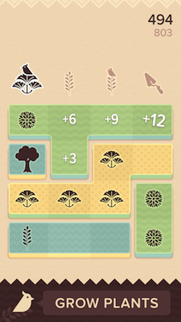

<a href="/"> </a> <br>

<span style="display:inline-block;width:100%;text-align:center;margin:auto;">A lovingly handcrafted free cross platform game engine
[guides](./user-guide.md) • [source](https://github.com/luxeengine/luxe-alpha) 
</span>

---

# About
luxe is a lovingly handcrafted free, open source cross platform rapid development game engine for deploying games on Mac, Windows, Linux, Android, iOS and Web. 

<div style="margin:auto; display:flex; width:75%; justify-content:center;">


</div>
<br/>
<span style="display:block;text-align:center">[Here are some games made with it](#games).</span> 

---

# luxe 1.0 is coming...


<div style="text-align:center";> 

<h2>Please be aware there is a major transition happening</h2>    
The transition is from <em>design</em> exploration phase to final implementation of the engine. We are busy with the <strong>execution</strong> phase, which will become available soon. 
<br/>
<br/>
<h2><a href="https://luxeengine.com/">Visit the new site</a> to find out more! <br>or <a href="/news">subscribe</a> for updates </h2>
</div>

---

All the details of this transition are being expanded in the [development logs](/tag/dev)! 
In short: The _alpha code base was temporary_ and is going away. 

**The information on the engine below is regarding the alpha stage.**   
The page below refers to the "alpha-1..3" phase in the below diagram.


---

# Development

All the latest development news is always posted here on this blog. 
To get notified when new posts are made [visit the news page](https://luxeengine.com/news/).   
There are currently two forms of development updates:

- [**development**](/tag/dev) - In depth development posts • **read these!**
- [**status**](/tag/status) - Status updates


# Community
Please read the [**community conduct**](/community) page before getting involved.

All development **questions, discussions, bugs** and issues are welcome and should be posted on **[the support repository](https://github.com/luxeengine/support/)** – This allows everyone to find them in one place. If you have any questions, or have run into an issue, please feel free to post it. That's what it's for!

You can also find help and friends on the [**community chat**](/chat).

---

# Getting started (alpha)

## [view setup guide](/get)
## [view luxe user guide](/guide)
## [view API reference](/api)

---

## Quick look (alpha)

```haxe
var player = new Sprite({
    texture : Luxe.resources.texture('assets/player.png'),
    pos : Luxe.screen.mid,
    depth : 4
});
```

---
# Development
Currently development is centered on finishing luxe 1.0.0. The focus is placed heavily on being a strong 2D engine first along with good stability, plus a fluid and iterative workflow. 3D is supported but will mature later.

## Design Philosophy

luxe is designed with numerous fundamental design choices – as you would expect – although there are some key ones that make it differ in ways that will influence assumptions when using it. Below briefly mentions some of these to make it easier to understand the goals of the engine. 

**luxe is a facilitator**   
The engine supplies and supports common patterns for making games, like Components/Entity systems, State Machines and Events messaging systems. **These are not enforced and do not stop you from doing your own thing**, bypassing those in favour of your own specific methodology or game specific architecture.

luxe is minimalistic in core and design which means that application/game specific domain features are left up to libraries and the application itself. It might not supply every feature you need for your specific game, but it will make it very easy to get there quickly. Therefore, luxe contains many helpers in functions and systems for you to use when building your games.

## Features (alpha)

**Short list and focuses**

- `Open` - Free and Open Source, under the [MIT license](https://github.com/underscorediscovery/luxe/blob/master/LICENSE.md)
- `Approachable` - high pace through an expressive, easy to use API. 
- `Rapid` Fits jam games and long form projects alike.
- `Documentation` - continuous focus on documenting with high standards
- `Audio` - OpenAL/WebAudio backed portable audio API
- `Rendering` - WebGL spec based API, same code on all platforms
- `Portable` - written to be ported, supporting new platforms is simpler
- `Input` - Low level, immediate, event based OR high level API for Gamepad, Touch, Keys and Mouse

**gameplay**

- `Scene` - simple scene container management
- `Collision` - SAT collision query for shapes and rays 
- `Physics` - third party framework hooks, i.e [nape](http://napephys.com/). 
- `Transforms` - stackable transforms for positioning/rendering
- `Timing` - control over time scale, per entity fixed rates and more
- `Timer` - schedule functions and events into the timeline
- `Audio` - simple to use but flexible audio api

**Rendering**

- `Sprite` - visual backed class with animation, flipping etc
- `Color` - handle HSV, HSL, RGB interchangeably
- `Render` - automatic or self managed batching of geometry
- `Render control` - flexible depth, blending and group rendering
- `OpenGL` - direct or indirect access to WebGL spec API
- `Shaders` - first class citizen, built into the core of rendering
- `Camera` - split views, focus, rotation, shake, etc built in
- `Tilemaps` - isometric, ortho support, with import from [Tiled](http://mapeditor.org)
- `Drawing` - easy style shape/geometry drawing API
- `NineSlice` - for scaling of assets like UI elements
- `Particles` - simple particle support for quick effects
- `Textures` - easy to use texture api, fully supports render to texture
- `Fonts` - BMFont based bitmap font rendering

**systemic**

- `Assets` - cross platform access to assets
- `Maths` - support for Vector, Matrix and Quaternion based maths
- `States` - modal, transient and stacked state machine 
- `Events` - expressive filterable local or global events
- `Components` - modular code (behaviour composition) 
- `Structural` - common data structures [link](https://github.com/underscorediscovery/structural)
- `Tweening` - customized Actuate built in
- `Utils` - many geometrical and game related utilities
- `Parcel` - control preloading, loading/unloading parcels of assets

---

<a name="games"></a>
# games (alpha)

Even though luxe is in alpha, people have released a number of games already. From jam games to full releases, here are a few games you will find around.
Since there are numerous games, only a small selection are listed in no particular order. 

#### The Westport Independent
Released on Mac, Windows, Linux (Steam, GOG), Android (Play, Amazon), iOS
[Visit the website for full details](http://www.doublezeroonezero.com/westport.html)

<a target="_blank" href="http://www.doublezeroonezero.com/westport.html">
<div class="screenshot">


</div>
</a>


#### Topsoil
Released on iOS and Android with a web based demo.
[Visit the website for full details](https://topsoilgame.com)

<a target="_blank" href="https://topsoilgame.com">
<div class="screenshot bigger" style="height:20em">



</div>
</a>


#### Operator Overload
Released on Steam for Mac, Windows and Linux
[Visit the website for full details](http://benn-gaming.co.uk/operatoroverload.html), [Steam page](http://store.steampowered.com/app/499140/Operator_Overload/)

<a target="_blank" href="http://benn-gaming.co.uk/operatoroverload.html">
<div class="screenshot">


</div>
</a>

#### Rise
Released on Steam as part of [HELP: THE GAME](http://store.steampowered.com/app/472770/) bundle
[Visit the website for full details](http://store.steampowered.com/app/497380/)

<a target="_blank" href="http://store.steampowered.com/app/497380/">
<div class="screenshot">


</div>
</a>

#### QWOP (WebGL)
Released as a port to WebGL to support more players (originally in Flash)
[Visit the website for details and to play](http://www.foddy.net/Athletics.html?webgl=true)

<a target="_blank" href="http://www.foddy.net/Athletics.html?webgl=true">
<div class="screenshot">


</div>
</a>

#### THREES (WebGL)
Released as a port to the web platform (originally in Unity)
[Visit the website for details and to play](http://play.threesgame.com)

<a target="_blank" href="http://play.threesgame.com">
<div class="screenshot bigger">


</div>
</a>

---

<small>
All product names, logos, and brands are property of their respective owners. WebGL and the WebGL logo are trademarks of the Khronos Group Inc.
</small>