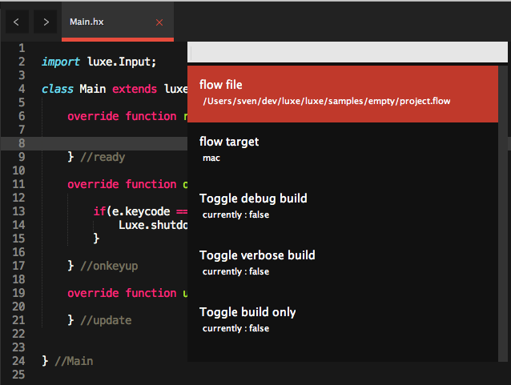
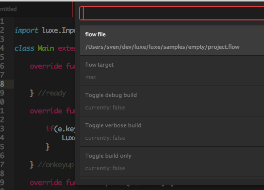
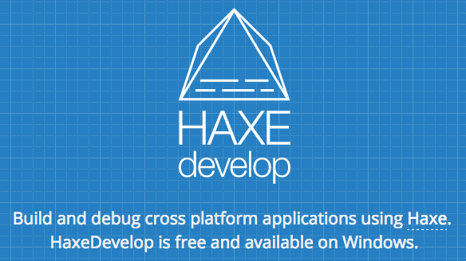

[](/get)

---

Full code completion and building from the IDE are typically supported.   
See the following pages for setup instructions.

##### [Sublime Text](#sublimetext)
##### [Atom.io](#atom)
##### [VSCode](#vscode)

---

#### Sublime Text
https://www.sublimetext.com/ (version 3)  
[setup instructions](https://snowkit.github.io/flow/guide/sublimetext.html)   
Mac / Windows / Linux
<a href="https://snowkit.github.io/flow/guide/sublimetext.html">

</a>

---

#### Atom
https://atom.io/   
[setup instructions](https://atom.io/packages/flow)   
Mac / Windows / Linux
<a href="https://atom.io/packages/flow">

</a>

---

#### VSCode 
https://code.visualstudio.com/
Setup instructions below   
Mac / Windows / Linux


To use VSCode with luxe:

- Install [VSCode](https://code.visualstudio.com/)
- Install vshaxe extension - [Instructions](https://github.com/vshaxe/vshaxe/wiki/Installation)   
- Create the following files if you don't have them already:
   - Create a `.vscode` folder in your project
   - Create `.vscode/settings.json`
   - Create `.vscode/tasks.json`

##### completion - `.vscode/settings.json`
vshaxe needs to know which hxml file to use for code completion.

With luxe, **specify the hxml file inside your bin folder**, as it is always going to be correct for your project.flow file. 

> If the bin folder doesn't exist yet for your target of choice, you may need to run `flow info <target>` or `flow compile <target>` once to generate it for you. For example, to build for web and there is no `bin/web.build/` run `flow info web` to generate it.   
*<small>:todo: This should be fixed/not necessary.</small>*

You can specify multiple configurations, and switch between them from the command palette "Haxe: Select display configuration".

```
{
    "haxe.displayConfigurations": [
        ["bin/mac64.build/build.hxml"], //mac build
        ["bin/web.build/build.hxml"]    //web target
    ]
}

```

##### building/running - `.vscode/tasks.json`

To build and run your project from vscode you just need a tasks file. These are documented by vscode itself, but for ours it's a basic command. 

If you want to run a specific target, add it to the args, i.e `"args": ["run", "web"]` or add multiple tasks (see vscode documentation).

You can access the command palette to see tasks options, but there is usually a default key for `Run Build Task`. On mac this is `Cmd-Shift-B` for example. This will run your project.

```
{
    "version": "2.0.0",
    "command": "flow",
    "args": ["run"],
    "problemMatcher": "$haxe"
}
```

#### [Haxe develop](https://snowkit.github.io/flow/guide/flashdevelop.html)
Windows Only
<small>HaxeDevelop is a build of FlashDevelop for Haxe. 
The instructions are the same for both, but the setup page will mention FlashDevelop.</small>
<a href="https://snowkit.github.io/flow/guide/flashdevelop.html">

</a>