<a href="/"> </a>

---
<small>If you are looking for the alpha setup guide, [you can find it here](./luxe-alpha-setup-guide.html).</small>
<small>If you are looking for the alpha API docs, [you can find them here](./api).</small>

**please note** this documentation is for the old deprecated luxe alpha only.   
luxe 1.0 is coming... see https://luxeengine.com/

<a name="start"></a>
#### [ (alpha) Beginners guide ](#beginnersguide)   
**The beginners guide is a linear guide**,   
it follows a semi logical progression about understanding some of the core concepts while working with luxe alpha. Things like building and running, assets, input and more.

[#1 - **Getting Started**](#gettingstarted)    
[#2 - **Images and sprites**](#imagesandsprites)    
[#3 - **Sprites and animation**](#spritesandanimation)    
[#4 - **Text and audio**](#textandaudio)    

<a name="list"></a>
#### [ Feature guide ](#featureguide)   
The feature guide is a piece by piece reference for specific features of the engine, designed to explain and teach what the engine can do.

**gameplay**

[ timers ](#timers)   
<small>wip - ~~audio~~ - ~~transforms~~ - ~~app timing~~ - ~~scene~~ - ~~physics~~ - ~~collision~~</small>

**rendering**

[sprites](#sprite)   
[sprite animation](#spriteanimation)    
[color](#color)   
[render control](#rendercontrol)   
[shaders](#shaders)    
[drawing](#drawing)    
[fonts](#fonts)    
<small>wip - ~~render batching~~ - ~~cameras~~ - ~~tilemaps~~ - ~~nineslice~~ - ~~particles~~ - ~~textures~~</small>

**systems**

[assets](#assets)   
[events](#events)   
[components](#components)   
[utils](#utils)    
<small>wip - ~~maths~~ - ~~states~~</small>

----

<a name="gettingstarted"></a><a name="one"></a> &nbsp;   
[back to top](#start)

---

## #1 - Getting started
<small>code for this guide is found in [**`samples/guides/1_getting_started/`**](https://github.com/luxeengine/luxe-alpha/tree/master/samples/guides/1_getting_started/src/Main.hx)</small>


<span style="display:block;width:100%;text-align:center"> guide outcome </span>

### An empty project

For now, as luxe is in development,    
**copy the `luxe/samples/empty` folder as your starting point**.

_This will be automated in future.    
Some editors (like HaxeDevelop) have a new project template already._

#### Basic Anatomy 

### A flow file?!

When you build a luxe app, it's built by flow, a build tool that reads a project file.   
Your **project file is called a flow file**, and has the extension `.flow`.
This is essentially the entry point to working with your project.

Open your `project.flow` file and look inside, you'll find information specific to your project that you can configure.

Here's is an example of what that looks like:

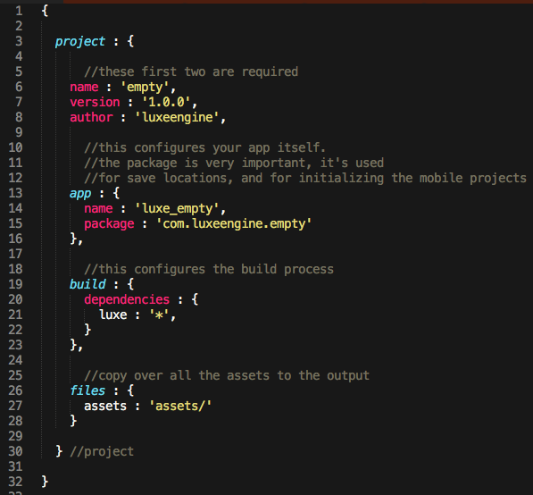

#### Your game code

The second place to look, is the `src/Main.hx` file, which is where your game begins. For reference, `src` is short for `source` code. Typically you would put your game haxe code in this folder.

A luxe app, in it's very basic form, is a single haxe class that extends from `luxe.Game`. It has some functions that you override, like the `ready` function, which is where you start coding your game. 

If you ran this code, you would see a blank window.
We'll see how to run the game a bit further down.

```haxe
class Main extends luxe.Game {

	override function ready() {
	   //your game starts here
	}

}
```

Aside from the `ready` function, there are quite a few that you can override in order to handle luxe system events - like `onkeyup(event:KeyEvent)` or `update(delta:Float)`. The first being when a key is released, and update is called every frame for you, so you can update your game logic.

### The `config` function

One important function in your game is the `config` function. This function gets called for you _before_ ready happens. This means that anything you configure here, will be setup when the game is ready.

It is important to note, the function serves to configure your game app _before it launches_, meaning that almost all of the engine systems are unavailable in here.

For now, you can see what the config options are and specify them to your liking. We'll use this function again in the next guide.

```haxe
override function config(config:GameConfig) {

    config.window.title = 'luxe game';
    config.window.width = 960;
    config.window.height = 640;
    config.window.fullscreen = false;

    return config;

} //config
```

### The empty Game class

Now that we're a bit more familiar, this is how the full empty game might look.

```haxe
import luxe.GameConfig;
import luxe.Input;

class Main extends luxe.Game {

    override function config(config:GameConfig) {

        config.window.title = 'luxe game';
        config.window.width = 960;
        config.window.height = 640;
        config.window.fullscreen = false;

        return config;

    } //config

    override function ready() {

    } //ready

    override function onkeyup(event:KeyEvent) {

        if(event.keycode == Key.escape) {
            Luxe.shutdown();
        }

    } //onkeyup

    override function update(delta:Float) {

    } //update

} //Main
```
---

### Building and running a luxe game

Your project file contains the information necessary to instruct the build tool - `flow` - on how to build your game.

flow is a command line tool but is integrated into editors like so that you can work from those instead, if you prefer. You can see how to configure that here in the [setup guide](./luxe-alpha-setup-guide.html).

For now, we will stick with the command line for reference on what is happening.
If you haven't installed the flow shortcut (via snowfall for example) then you need to add `haxelib run` in front of each command below. 

**flow run**   
To run the game, you type `flow run` into the command line and hit enter, which you do from within your project folder. This will run all the steps necessary to convert your code into an application, and then launch it.

If you want to build without running, use `flow build`.
If you want to launch without building, use `flow launch`.

You may need to run in debug mode to find the cause of runtime errors - to do that you would just append a `--debug` flag to the command. The final command would be `flow run --debug`. 

<small>_Note that debug mode is significantly more expensive to run, making the game run less smoothly at times. If you aren't debugging a crash you would likely be ok without the debug flag_.</small>

---

#### Getting something on screen

Now that we have a blank window, let's draw a sprite and move it around!

To use code classes from luxe, we usually import them first. Imports go at the top of the file. Since we are going to make a sprite with a color and a position, we need the `luxe.Sprite`, `luxe.Color` and the `luxe.Vector` class. You don't have to import them this way, since you can reference them by their full name like above if you prefer.


```haxe
import luxe.Sprite;
import luxe.Color;
import luxe.Vector;
```

**luxe options**   
In luxe, most constructors of objects specify their options in an object.
This solves many annoyances while working and allows you to succicntly specify only the arguments you care about, and let the rest be handled by sane defaults.

An options object is a regular haxe "anonymous object", 
it would look like this in a simple example :

`{  name:'a sprite' }`

To hand it to the constructor, you just put it in between the parenthesis. 
You'll see a full example just below this:

`new Sprite({ name:'simple example' });`

**Creating a Sprite**   
For now, we will create a small orange block in the middle of the screen and give it a color, a size and a position. The name is optional, but it will make your project infinitely easier to work with if you name things from the start.

We will make our sprite and store it in a variable named `block`. This is because we want to move the sprite later when the mouse moves, so we need to hold onto the sprite we create to do that.

The variable is declared inside the class, outside of the functions. Usually at the top, right under the "class Main" part.

Inside the ready function, we create the sprite and store it in our variable.
When you run this you should see an orange block in the centre of the screen!

```haxe
var block : Sprite;

override function ready() {

	block = new Sprite({
		name: 'block sprite',
		pos: Luxe.screen.mid,
		color: new Color().rgb(0xf94b04),
		size: new Vector(128, 128)
	});

} //ready

```

---

#### Moving things around

**The `onmousemove` function** 

The Game class has a function you can override called `onmousemove`. It also has `onmousedown` and `onmouseup`. Each of them take the same argument, `(event:MouseEvent)`. We can use the mouse move event to change the position of the block to match the mouse.

To do that, we can set the `pos` property of the block directly, which is a `Vector`. The vector also has an `x` and a `y` component that you can set too, for instance you can do `block.pos.x += 10;` to shift it ten units.

Start by overriding the `onmousemove` function, just below `ready`, and use the event information to move the block:

```haxe
override function onmousemove(event:MouseEvent) {

	block.pos = event.pos;

	// also valid:
	// block.pos.x = event.x;
	// block.pos.y = event.y;

} //onmousemove
```

&nbsp;
#### Updating things every frame

The last thing to learn in this guide is the `update` event function,
we will rotate the block a small amount each frame.

To do this, the sprite class has a `rotation_z` property for convenience. It's a value set in degrees for the sprite's rotation. If we want to animate the block spinning indefinitely, we simply add a small amount to this each frame. 

One thing to note though, is that we want the value to update consistently over time. To make that happen, we scale the change by the delta (difference in) time. This scaling of time makes sure it adds the amount as "per second" rather than "per update", so if the game runs faster on a faster device, it won't spin faster.

Run this and it should behave like the animated image above.

```haxe
override function update(delta:Float) {

        //if we add 40° each frame, and scale it by the delta,
        //it becomes 40° per second instead of 40° per update.

    block.rotation_z += 40 * delta;

} //update
```

---

That's the basics of getting things on screen, updating things every frame, and using the override functions from the Game class to get key, mouse and other forms of input. 

<a name="imagesandsprites"></a><a name="two"></a> &nbsp;  
[back to top](#start)   

---

## #2 - Images and sprites
<small>code for this guide is found in [**`samples/guides/2_sprites/`**](https://github.com/luxeengine/luxe-alpha/tree/master/samples/guides/2_sprites/src/Main.hx)</small>

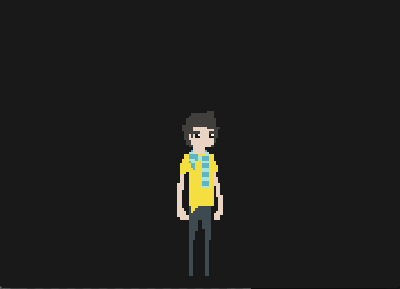
<span style="display:block;width:100%;text-align:center"> guide outcome </span>

#### Drawing images instead of blocks

This guide covers image loading, sprite flipping, pixel art scaling and mapping input.

#### Loading an image asset

Loading assets is typically an asynchronous concept, on many platforms this is an literal requirement. luxe handles assets asynchronously for you, making it easy to manage. The only important thing to remember when getting started, is that **you can't use an asset that you have not loaded yet.**

> In luxe, the word `Texture` is used and it just means “image”. It's just the term that the hardware rendering API's use. You will also notice the `phoenix` package used, `phoenix` is the name of the rendering backend that luxe is currently using.

**Loading an image during preloading**

> A **parcel** is what luxe calls a list of assets, and is used to load and unload groups of resources.

The first method of loading an image, is to load it in the `config` function. The config holds a default **parcel** for you, that you can quickly and conveniently put assets to be loaded _before your ready function is called_. This means you can use it right away.

As mentioned in the previous guide, the config function is before the engine is ready, meaning that you can't draw things (like a progress bar). The config parcel is for iterating quickly, and for assets that are needed before your game is loaded. For instance, a splash screen image would be loaded here, the displayed in ready. If your game assets are small enough, loading all of the assets this way is not a problem.

We add the image to the list of textures to be loaded in the `preload` parcel. It has a `textures` list, so we give it an object with an `id` by adding it to the list.

```haxe
    override function config(config:luxe.GameConfig) {

        config.preload.textures.push({ id:'assets/stand.png' });

        return config;

    } //config

```

&nbsp;
When ready happens, the image is loaded, and accessed via the resources API. 

```haxe
    //fetch the previously loaded texture!
var image = Luxe.resources.texture('assets/stand.png');
```
---

### Displaying the image

In `ready`, we can set the filtering for pixel art, so that drawing it bigger doesn't blur it. We also calculate a good size that fits the current window, and create a sprite to display it.

We also handle some input binding, but we will get to that next.

```haxe
 override function ready() {

        //fetch the previously loaded texture!
    var image = Luxe.resources.texture('assets/stand.png');

        //keep pixels crisp when scaling them, for pixel art
    image.filter_min = image.filter_mag = FilterType.nearest;

        //work out the correct size based on a made up ratio
    var ratio = 1.75;
    var height = Luxe.screen.h/ratio;
    var width = (height/image.height) * image.width;

        //create the actual visible player, give it the texture
    player = new Sprite({
       name: 'player',
       texture: image,
       pos: new Vector(Luxe.screen.mid.x, Luxe.screen.h - (height/ratio)),
       size: new Vector(width, height)
    });

        //set up keys and values for moving around
    move_speed = width * 3;

    connect_input();

} //ready
```

---

### Basic input handling

To move the sprite around a bit, we will use one of a few methods to handle input. We saw the direct event functions last time, and another alternative type is to check a state value every frame. This usually means putting key bindings spread out around your code, making it a bit trickier to change later.

To make this type of input less hardcoded, luxe supports the notion of "named input bindings". This is what it sounds like, it binds an input event to a name. From there, you can handle the named events, rather than the raw input. This also let's us bind multiple keys to a single _name_, making our resulting code much simpler. 

Here is how the `connect_input` method would look. We only need left and right in this guide, so we bind two common mappings to those names:

```haxe
function connect_input() {

    //here, we are going to bind A/left and D/right into a single named
    //input event, so that we can keep our movement code the same

    Luxe.input.bind_key('left', Key.left);
    Luxe.input.bind_key('left', Key.key_a);

    Luxe.input.bind_key('right', Key.right);
    Luxe.input.bind_key('right', Key.key_d);

} //connect_input
```

### Simple movement logic

We are going to keep things simple by shifting the player along the x axis, which looks pretty strange but we'll add animation in the next guide to make it appear less rigid.

To do that, we ask luxe during the update function if the input named "left" is pressed down. This type of input handling in luxe is called "immediate query", since you ask for an immediate result. If it returns true, it means the keys we bound were in a down state, so we move left. 

Since our image is facing the other way when moving left, we also flip the sprite so it faces the direction we're moving in. The same applies for moving to the right. Again we see that we scale the movement by time, so that the movement is consistent.

```haxe
override function update( delta:Float ) {

    if(Luxe.input.inputdown('left')) {

        player.pos.x -= move_speed * delta;
        player.flipx = true;

    } else if(Luxe.input.inputdown('right')) {

        player.pos.x += move_speed * delta;
        player.flipx = false;

    }

} //update
```

And we're done! 
In the next guide we'll add some animation and more.


<a name="spritesandanimation"></a><a name="three"></a> &nbsp;  
[back to top](#start)   

---

## #3 - Sprites and animation
<small>code for this guide is found in [**`samples/guides/3_sprite_animation/`**](https://github.com/luxeengine/luxe-alpha/blob/master/samples/guides/3_sprite_animation/src/Main.hx)</small>

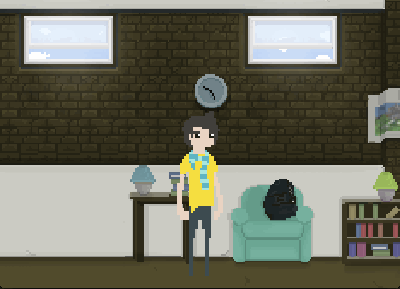
<span style="display:block;width:100%;text-align:center"> guide outcome </span>

#### Animating a sprite

This guide covers sprite animation and a simple loading screen with a progress bar.

---


### Loading with a progress bar

The previous guide mentioned that a parcel is a list of assets, which are loaded and unloaded as a group. We used the built in preload parcel from the config function, this time we'll make our own parcel and we'll also track the loading progress using the built in `luxe.ParcelProgress` class. We import that and `luxe.Parcel`.

We're going to load a background image, a player sprite sheet for the animation, and a json file which describes the animations for the player. We define a parcel with a list for json items, and a list for textures. When we load this parcel, it will load these items for use.

```haxe
var parcel = new Parcel({
    jsons:[ { id:'assets/anim.json' } ],
    textures : [
        { id: 'assets/apartment.png' },
        { id: 'assets/player.png' }
    ],
});
```

We also want a very simple progress bar, and we use the `ParcelProgress` class to get it. What happens is that the parcel emits events, telling anyone who wants to know, about what is happening with the parcel. Things like progress, failed items and completeness are sent out and the `luxe.ParcelProgress` class simply listens in and updates the visuals accordingly.

To use it is simpler than that:

```haxe
new ParcelProgress({
    parcel      : parcel,
    background  : new Color(1,1,1,0.85),
    oncomplete  : assets_loaded
});
```

The `oncomplete` field for the options object is a function to be called when the parcel has been loaded. In this case we make a function in our game class called `assets_loaded` and continue in there. This makes the execution of our game go:

`ready` => [ parcel loading ] => `assets_loaded`

And while that happens, we see the progress on screen. We can now carry on with our game code inside `assets_loaded` where our assets are now available to use. Before we do that though, inside `ready` after creating the progress bar, we have to tell the parcel to load.

```haxe
parcel.load();
```

### after loading

The `assets_loaded` function continues what `ready` would do, so we create the world and it's contents, and connect the input like the previous guide.

```haxe
function assets_loaded(_) {

    create_apartment();
    create_player();
    create_player_animation();
    connect_input();

} //assets_loaded
```

> The `_` character is used to ignore arguments that you don't really care about on a function. Say you had a function like `add(a:Int, b:Int)` but you only cared about `a` you could declare the function as `add(a:Int, _)`. 

> This is convenient when you have callbacks that give you information that you're not going to need yet, like above.


**creating the player and the apartment**

The background is just a sprite, and so is the player!
We're familiar with how to create those, so you can view the code sample to see the details.

#### Sprite frame animation

In luxe currently sprite animation is handled by a _component_ which gets attached to an _entity_. A `luxe.Sprite` is an entity and the `luxe.components.sprite.SpriteAnimation` is a `Sprite` specific component. You can only attach this component to a `Sprite`.

> A **component** is a design pattern that has been around for a long time, which composes game specific entity behaviours using modular pieces. For instance, a player might be composed of a `Health`, `Hunger` and `Thirst` components. A creature in this same game can also use these components, but only the first two. 

> This makes it powerful for creating variety and flexibility where entities can be anything at anytime, simply by their composition at the time, and not the code inside their class that's baked in. 

> Many engines employ this model, and there are quite a few variations of the pattern around. **[This guide](#components) talks about components in more detail**.

**creating and attaching a sprite animation component**   

By this point, we've created a `player` variable, which is a `Sprite` and can accept the animation component. We're going to want to keep hold of the animation component that is created, because we want to change the animation playing when moving around.

```haxe
    //create the animation component and name it anim
var anim = new SpriteAnimation({ name:'anim' });
    //add the component to the player sprite/entity
player.add(anim);
```

An alternative approach is to leverage the fact that `add` will return the component instance as well. They do the same thing, but offer a succinct way which clarifies code when creating multiple components in a row.

```haxe
anim = player.add( new SpriteAnimation({ name:'anim' }) );
```

**Defining some animation data**   

How do we tell it what our animations look like? 
Sprite animations are usually stored in packed images, which puts the frames of the animation in a single image. 

Here is our player sprite sheet, with an idle and walk animation stored as frames. This particular sprite was created quickly for a previous project by the talented [andrio](https://twitter.com/_andrio).

_Note that sprite sheets aren't required, you can use separate textures but this is typically inefficient. See [**`tests/features/sprite_animation`**](https://github.com/luxeengine/luxe-alpha/tree/master/tests/features/sprite_animation)_.

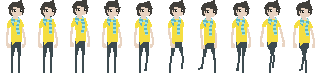

To tell the animation component where each animation is and how it works, we will use a json file for convenience.

```json
{
    "idle" : {
        "frame_size":{ "x":32, "y":73 },
        "frameset": ["1-3", "hold 2", "4","2-1", "hold 10"],
        "loop": true,
        "speed": 8
    },
    "walk" : {
        "frame_size":{ "x":32, "y":73 },
        "frameset": ["5-10"],
        "loop": true,
        "speed": 9
    }
}
```

You can see that the json frame sets are quite expressive. It allows timing to be expressed through frame numbers. The speed parameter is frames per second. _Note that frame numbers in images always start at 1. There is no frame 0 in an animation._

**finalizing the animation**   

Most of this should be self explanatory and has comments, we use the resource manager to get our parcel items we loaded, we add the component, and we define our animations using the json. Once done, we set the animation by name to the one we want, and we tell it to play!

```haxe
function create_player_animation() {

        //create the animation component and add it to the sprite
    anim = player.add( new SpriteAnimation({ name:'anim' }) );

        //create the animation from the previously loaded json
    var anim_data = Luxe.resources.json('assets/anim.json');

        //create the animations from the json resource
    anim.add_from_json_object( anim_data.asset.json );

        //set the idle animation to active
    anim.animation = 'idle';

    anim.play();

} //create_player_animation
```

#### Changing animations for walking

A lot of the movement code hasn't changed, so we'll only focus on the animation differences.

We saw the `animation` property set to `idle` earlier, so we can change it to `walk` while they're moving:

```haxe
    //set the correct animation
if(moving) {
    if(anim.animation != 'walk') {
        anim.animation = 'walk';
    }
} else {
    if(anim.animation != 'idle') {
        anim.animation = 'idle';
    }
}
```

And that's how to animate things!
The full code sample is linked at the beginning of the guide and continues on from the previous guide. The next guide doesn't follow the same code but uses a lot of the concepts already introduced.

<a name="textandaudio"></a><a name="four"></a> &nbsp;  
[back to top](#start)   

---

## #4 - Text and audio
<small>code for this guide is found in [**`samples/guides/4_text_and_tweening/`**](https://github.com/luxeengine/luxe-alpha/blob/master/samples/guides/4_text_and_tweening/src/Main.hx)</small>

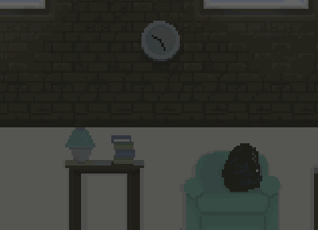
<span style="display:block;width:100%;text-align:center"> guide outcome </span>

#### :todo:
_This guide has not been written but the code sample is commented well_.

&nbsp;   
&nbsp;   
&nbsp;   

---

#Gameplay guides

<a name="timers"></a> &nbsp;  
[back to top](#start)   

---

## Timers and schedules

### Luxe.timer

To schedule things ahead of time, you have two options.

- use `Luxe.timer` (returns a `Timer` instance)
- use `snow.utils.Timer` class directly 

A comprehensive example of this is demonstrated in [beginner's guide #4](#four).   
A schedule is given a haxe function that will be called at a later time. In luxe, **time is always in seconds**.

```haxe
var timer = Luxe.timer.schedule(time, function() {
    trace("This code happens in the future");
});
```

**stopping or cancelling a timer**   
To stop the timer, you need the timer instance itself returned from `schedule`.

```haxe
timer.stop();
```

#### future goals

- pause
  - pausing all or a single timer
- timer grouping 
  - i.e controlling game specific timers vs menu specific timers

# Rendering guides

<a name="sprite"></a> &nbsp;  
[back to top](#start)   

---


## Sprite features

The [beginners guides](#start) cover basic sprite usage.
The `Sprite` class extends the `luxe.Visual` class, which is a geometry container. `Sprite` is also a `luxe.Entity`, so it can accept `luxe.Component` attachments.

The sprite class is a Quad based geometry, and facilitates common actions with a quad based, textured sprite. If you want non quad geometry, use `luxe.Visual` instead, as sprite is a quad specialization.

In concept a sprite is 2D, but no restriction on 3D rotation or positioning is applied. All 2D helpers will only affect x/y relative properties of the sprite.

### Sprite specific features

**centered**

By default, the sprite origin will be centered. By setting the centered flag to false, it will be top left instead. The centered flag is used only when a custom origin is not specified, it will not override the explicit origin.

The centered flag sets the transform `origin` to `size/2`.

**flipx/flipy**

The `flipx` and `flipy` flags will flip the geometry along it's own x or y axis respectively. Flipping works by changing the UV coordinates of the texture, based on the existing uv coordinates. Comes from `phoenix.geometry.QuadGeometry`.

If the flip flag is already setting, setting it twice has no effect.

**size**

The size of the geometry in units, which allows setting a baseline size of the geometry. This differs from the scale transform as it is in units, allowing simpler scaling through a preset size. Comes from `Visual` (note this shouldn't be there).

**uv**

A rectangle in texture pixels for the UV coordinates of this sprite. Can be animated through setting the properties of the UV or assigning a new UV.
Comes from `phoenix.geometry.QuadGeometry`.

**rotation_z**

A convenience for setting the 2D rotation (around the z axis) **in degrees**. Will also change `radians` to match. Comes from `Visual`.

**radians**

A convenience for setting the 2D rotation (around the z axis) **in radians**. Will also change `rotation_z` to match. Comes from `Visual`.


<a name="spriteanimation"></a> &nbsp;  
[back to top](#start)   

---


## SpriteAnimation features

The [beginners guides](guide.html#beginnersguide) cover the basic sprite and sprite animation usage. The `SpriteAnimation` class extends the `Component` class, allowing it to be attached to a `Sprite`. This component can only be attached to a `Sprite` or child instance.

**Animation type**   

The `SpriteAnimation` component supports

- uv animation from a packed sprite sheet
- image sequence from separate textures

### Controlling playback

For each example, anim is an instance of a `SpriteAnimation`

**get/set animation**

```haxe
    //set
anim.animation = 'name';
    //get
var name = anim.animation;
```

### Current animation

**get/change speed**

```haxe
    //set
anim.speed = 25;
    //get
var speed = anim.speed;
```

**set a specific frame**   
Uses frame index, not image frame.

```haxe
anim.set_frame(6);
```

**control playback**

```haxe
    //reset the animation to the first frame
anim.restart();
    //play/resume the animation
anim.play();
    //stop/pause the animation. Does not reset the frame.
anim.stop();
```

**add/remove frame events**

Frame events allow the animation to tell you when it reached specific key frames during playback. These can be used to spawn particles, play sounds and so on.

```haxe
    //add event at frame 6
anim.add_event('animation', 6, 'event_name'); 
    //remove a specific event from this frame
anim.remove_event('animation', 6, 'event_name');
    //remove all events from this frame
anim.remove_events('animation', 6);
```

### Animation JSON Data

The animation frame JSON data consists of the following properties :

#### UV & Image sequence common settings

- `pingpong` : Bool
    - default: false
    - if true, the animation will reverse at the last frame
    - 1  2  3  2  1
- `loop` : Bool
    - default: false
    - if true, the animation will continue to loop
    - 1  2  3  1  2  3 etc
    - can combine with pingpong
- `reverse` : Bool
    - default: false
    - if true, animation will play in reverse
    - can combine with pingpong and loop
    - 3  2  1
- `speed` : Float
    - default: 2
    - frames per second to play at
    - can be 0
- `events` : Array of { frame:Int, ?event:String }
    - fires named _event_ on _frame_ into the attached sprite
    - IF _event_ is not given:
    - {animation}.event.{frame}, i.e "walk.event.5"
    - handler given [SpriteAnimationEventData](api/luxe/components/SpriteAnimationEventData.html)
- `frameset` : Array of String
    - required
    - sequential list of frames or frame actions:
    - range : "1-10"
    - frame : "1"
    - `hold n` hold current for _n_ frames of time : "hold 10"
    - `f hold n` hold specific frame _f_ for _n_ frames : "1 hold 10"
- `frame_size` : { x:Int, y:Int }
    - the size of a frame in texture pixels
    - acts as the default for frame_sources, if any
- `frame_sources` : { frame:Int, pos:{ x:Int, y:Int }, size:{ w:Int, h:Int }, source:{ x:Int, y:Int, w:Int, h:Int } }
    - optional
    - per frame custom size, position and source uv rect
    - uses frame_size in place of missing info

#### Image sequence type only

- `image_sequence` : String
    - name of a sequence of images :
    - i.e assets/idle => assets/idle0.png ... assets/idleN.png
    - will search for :
    - `name_0`, `name-0`, `name0` patterns
- `filter_type` : String
    - "linear" or "nearest", to set when loading the sequence


<a name="color"></a> &nbsp;  
[back to top](#start)   

---

## Manipulating color in luxe

Color is a very important tool in games, and being able to smoothly transition colors is important.   

When dealing with **RGB** color as is the default color type, it tends to break when you try and animate between two colours. The solution to this, is different color models, such as **HSV** (Hue, Saturation, Value) and **HSL** (Hue, Saturation, Lightness).

luxe supports both HSL and HSV interchangeably with the default of RGB (and each support alpha as well).

### What is the difference?


HSV and HSL are cylindrical in nature, that means that they are _round_ and their color value works in degrees(º) rather than components. 

Take a look at the image below, this is the color wheel (Hue only), mapped to degrees.

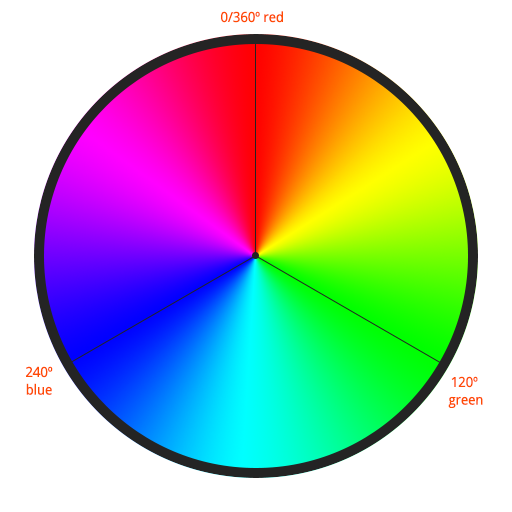

**How this helps**

Notice how if we want to transition from red (danger!) to orange (warning) on a flashing UI element, it's around 30º of movement?    

To animate that using Hue (the above color wheel) it is simple, we animate the hue value.

**Color classes have their own convenience tween function**   
One thing you will notice is that the color classes have their own tween function for convenience.

```haxe

        //We create our red color using 0º Hue (red), 
        //the second and third argument are saturation and value, 
        //which we set to "maximum" right now.

    var color = new ColorHSV(0, 1, 1);

        //Now we want to animate to orange, just change the hue
        //over two seconds, to orange

    color.tween(2, { h:30 });
```

By mapping the colors to a round cylinder it affords much smoother transitions between colors, much smoother than RGB can do.

### Saturation, Lightness and Value

Color can be quite a complex system, and has mathematical properties outside of the scope of this simple guide. If you want to get in depth details into the mechanics of color , [this article on wikipedia is quite thorough](http://en.wikipedia.org/wiki/HSL_and_HSV).

Now - for simplicity sake - we will define the terms in a less exact way. Take a solid color at hue 30º like above. 

- Value - The color approaches black when value is lowest
- Lightness - The color approaches white when the lightness is highest
- Saturation - The amount of color present (like draining the color away)

Have a look at these graphs [from Wikipedia](http://en.wikipedia.org/wiki/HSL_and_HSV) for a clearer view.

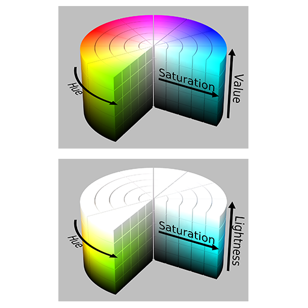

### Creating and using the different types

Now that you hopefully understand the purpose and differences, we can look at how to work with them in luxe.

```haxe
        //defaults for r g b and a are 1 (full white)
    var color: Color = new Color( r, g, b, a );

        //Defaults for h = 0, s = 0, v = 1, a = 1 (full white)
    var colorhsv: ColorHSV = new ColorHSV( h, s, v, a );

        //Defaults for h = 0, s = 1, l = 1, a = 1 (full white)
    var colorhsl: ColorHSL = new ColorHSL( h, s, l, a );
```

This is for creating, but how about switching between? 

**Changing color type**   
All types are extended from the `Color` class, so they automatically work where `Color` is expected. For example, a sprite color is typed as `Color` but a `ColorHSL` or `ColorHSV` can be given in place - `sprite.color = colorhsl;`

**This makes all types interchangeable automatically**, but the following functions are exposed as well.

```haxe
        // helpers on Color
    color.toColorHSL        //returns ColorHSL
    color.toColorHSV        //returns ColorHSV
    color.fromColorHSL      //changes color
    color.fromColorHSV      //changes color

        //helpers on ColorHSL
    colorhsl.toColor        //returns Color
    colorhsl.toColorHSV     //returns ColorHSV
    colorhsl.fromColor      //changes colorhsl
    colorhsl.fromColorHSV   //changes colorhsv

        //helpers on ColorHSV
    colorhsv.toColor        //returns Color
    colorhsv.toColorHSL     //returns ColorHSV
    colorhsv.fromColor      //changes colorhsv
    colorhsv.fromColorHSL   //changes colorhsv
```


<a name="rendercontrol"></a> &nbsp;  
[back to top](#start)   

---

## Render order and sorting

The rendering works by sorting items according to the following high level rules :

- Renderer
 - batchers, 
     - sorted by `layer` property
 - geometry, sorted by an order sort
     - `depth`
     - shader
     - texture
     - primitive
     - clipping
     - age

In general use, you control specific batches of items using a `Batcher`, specifying it's layer for overall order. Then, you specify geometry depths, **the rest is automatic**.

### Geometry depth

In luxe, "geometry depth" is not the same as the geometry z position in world space. The depth is a render tree depth, **controlling render order explicitly**.

If you want to draw spriteA above spriteB, setting spriteA depth to 2, and spriteB depth to 1, it will always rendering second.

**depth values**   
The depth value _is a floating point number_ which is convenient for "last minute" depth control, allowing finely grained details to matter. Some examples can be "all hud elements are between 10 and 11", where 10.1 is hud background, 10.2 is hud buttons, 10.3 is hud text and so on.

Because of this, `10.1` is a valid depth and so is `10.142325`. The granularity is subject to floating point errors, so try not to go too small here or you may get different sorting.

**uses**   
This is especially useful when render depth is calculated dynamically. In a 2D front down view, the depth can simply be the Y position in world space, and as avatars move through the space they update their depth to their position. It also allows division to be used to calculate sorting, which is helpful in situations where depth is calculated on the fly.

As the depth value is the first rule, it can also be used when working with depth testing and transparent objects. You could split transparent objects into a separate batcher, and control it as a whole, or you can separate it using the depth values, ensuring the render order is respected.

### Render callbacks

In your [game class](api/luxe/Game.html) you can override the `onprerender`, `onrender` and `onpostrender` events.

These are for _all_ rendering that happens, not a specific subset of geometry. This is useful if you want to do some explicit rendering into render targets before the rest is processed.

### Group render callbacks

In luxe, with phoenix (the rendering engine in luxe) you can listen for events from the batcher that geometry is in, in order to alter render state.

This allows you to specify render state (like blend modes) or control rendering into textures explicitly through the use of the callbacks.

Take a look at this example, we ask the default batcher to tell us when it is being rendered.

```haxe
override function ready() {

    Luxe.renderer.batcher.on(prerender, before);
    Luxe.renderer.batcher.on(postrender, after);

} //ready

function before(_) {

        //change how this group is blended
    Luxe.renderer.blend_mode(
        BlendMode.dst_color, 
        BlendMode.one_minus_src_alpha
    );

} //before

function after(_) {

        //reset to default blend mode
    Luxe.renderer.blend_mode();

} //after
```

And the results would be similar to :

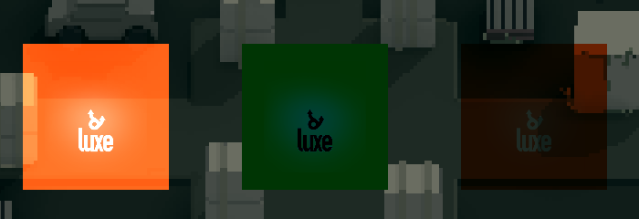


Blending and blendmodes are a frequent topic in rendering and you can explore the different types here :

[Anders Riggelsen blend modes online tool](http://www.andersriggelsen.dk/glblendfunc.php)

**Rendering a batcher to a texture**

You could also use the render callbacks to switch the rendering target.
If you listen for the callbacks as above, you can set and unset the target easily.

```haxe
function before(_) {

    Luxe.renderer.target = my_render_target;

} //before

function after(_) {

        //reset to default render target
    Luxe.renderer.target = null;

} //after
```

For a clearer example of rendering to a texture, see [**`tests/rendering/rendertexture`**](https://github.com/luxeengine/luxe-alpha/tree/master/tests/rendering/rendertexture)


<a name="shaders"></a> &nbsp;  
[back to top](#start)   

---

## Shaders in luxe

### What are shaders exactly?

I have written a comprehensive primer to shaders here!

### [**Shaders : A primer**](http://notes.underscorediscovery.com/shaders-a-primer/)
&nbsp;   
The series talks about shaders in various ways,   
but for the luxe specifics, we'll look at how to use them.

#### Using shaders in luxe

luxe makes using shaders easier by wrapping up the details, allowing you to load and apply shaders to your sprites and geometry easily. It also makes it simple to send information into the shaders.

Take a look at the code from the demo, and you should be able to follow along as to what is happening. As with other resources, you can't use it unless it is loaded. You can load shaders via a parcel, or via the resource manager.

```haxe
        //we create a variable to hold the shader
    var hue_shader : Shader;

        //and then we fetch the already loaded shader 
    hue_shader = Luxe.resources.shader('hue');

        //then we tell the sprite to use this shader when rendering
    hue_sprite.shader = hue_shader;
```

In our example, when we move the mouse, we send some information to the shader to change the color.

```haxe
    override function onmousemove( e:MouseEvent ) {

        var percent = e.pos.x / Luxe.screen.w;
        var hue = (Math.PI*2) * percent;

            //hue based on mouse x
        hue_shader.set_float('in_hue', hue);

    }
```

## shader code

The shaders in luxe currently use GLSL, the OpenGL Shading Language across all targets. There are many resources around for shaders and GLSL specifically so this guide won't need to cover that. The test code has some simple example shaders you can learn from.

**built in shaders**   
The default shaders the engine uses are in `phoenix/defaults/shaders`.

<a name="drawing"></a> &nbsp;  
[back to top](#start)   

---

## Drawing shapes as geometry

Luxe supports drawing a few shapes by default, each with some very similar options available. This is essentially a convenient way to draw debugging information quickly, and allows immediate (draw once) rendering. 

These are accessed via the `Luxe.draw` api, and return a `phoenix.geometry.Geometry` instance. Since geometry is lower level than say, a `Sprite`, it is often convenient to use the draw API as more of a factory for the geometry, that you then use in a higher level container (like a `Visual`).

- line    
- rectangle, box
- ring, arc, circle, pie
- text

There is a pattern here - a `rectangle` is an **outline**, and a `box` is **filled** in. A ring is an `outline`, a circle is `solid`. An arc is an `outline`, a pie is `solid`. 

**using the geometry in a visual** 

It's convenient to be able to treat the geometry as a higher level object, like an `Entity` which is what `Visual` is for. You can use the draw API to create visuals by handing it to the `geometry` property. We use 0,0 as the position because it will be centered on the visual's transform.

It's important to note though, the the _visual_ is what you're creating as the result of this, so there are some properties of the geometry created by the draw API that get overridden. For example, the color property is set on the visual level. If it was set on the geometry draw create step, it will have no effect.

```haxe
var visual = new luxe.Visual({
    color : new luxe.Color(0.8, 0.3, 0.2, 1),
    geometry: Luxe.draw.ring({
        x : 0,
        y : 0,
        r : 50
    })
});

visual.pos = Luxe.screen.mid;
```

#### examples

Drawing a line:

```haxe
	var mid_y = Luxe.screen.h/2;

	Luxe.draw.line({
        p0 : new Vector( 0, mid_y ),
        p1 : new Vector( Luxe.screen.w, mid_y ),
        color : new Color( 0.5, 0.2, 0.2, 1 )
    });
```

And a rectangle : 

```haxe
	Luxe.draw.rectangle({
        x : 10, 
        y : 10,
        w : Luxe.screen.w - 20, 
        h : Luxe.screen.h - 20,
        color : new Color( 0.4, 0.4, 0.4 )
    });
```

And a circle : 

```haxe
    Luxe.draw.circle({
        x : Luxe.screen.w/2,
        y : Luxe.screen.h/2,
        r : 50,
        color : new Color( 0.8, 0.3, 0.2, 1 )
    });
```

<a name="fonts"></a> &nbsp;  
[back to top](#start)   

---

## Fonts and text


### Creating custom bitmap fonts

The fonts currently supported by luxe are in a "AngelCode BMFont" format. This format has become widespread and many tools now exist to create fonts easily for it.

Some tools to generate a font, but Littera is the best free choice :

- [Littera](http://kvazars.com/littera/), online, free
- [bmGlyph](http://www.bmglyph.com/), mac only, commercial
- [glyphdesigner](https://71squared.com/en/glyphdesigner), mac only, commercial
- [BMFont](http://www.angelcode.com/products/bmfont/), windows only, free

If you want to color the text in luxe using geometry colors, you must create a white fill solid text, alpha.

**Export the fonts as .fnt text based format**. 

### Importing custom fonts

To use a custom font, you can use a [parcel](guide.parcels.html) (as shown in the [beginner guide](guide.four.html)), or, you can manually load the font yourself.

To do so, you use `Luxe.resources.load_font`. You can manually create a `phoenix.BitmapFont` and use `BitmapFont.load`, or even `new BitmapFont()` and `from_string` functions. The [BitmapFont API docs](api/phoenix/BitmapFont.html) have all the details.

To use `Luxe.resources.font` and `Luxe.resources.load_font` you should also read the [assets guide](#assets).   
Take note that the folder is separated from the file name, because there can and often are multiple texture sheets for a font set. The name is always without a path.

A more thorough example can be found in [**`tests/rendering/fonts/`**](https://github.com/luxeengine/luxe-alpha/tree/master/tests/rendering/fonts) and [**`tests/features/text/`**](https://github.com/luxeengine/luxe-alpha/tree/master/tests/features/text), [**`tests/features/text2/`**](https://github.com/luxeengine/luxe-alpha/tree/master/tests/features/text2)

```haxe
override function ready() {

    var get = Luxe.resources.load_font('assets/fonts/font.fnt');
    get.then(function(font:BitmapFont) {

        Luxe.draw.text({
            font: font,
            text : "LUXE\nLUXE",
            bounds : new Rectangle(
                0, 0, 
                Luxe.screen.w * 0.99, Luxe.screen.h * 0.98
            ),
            color : new Color().rgb(0xff4b03),
            align : TextAlign.right,
            align_vertical : TextAlign.bottom,
            point_size : 32
        });

    }); //onload

}
```

# system guides

<a name="assets"></a> &nbsp;  
[back to top](#start)   

---

## Assets system

The following asset types are supported directly by the API for convenience :

- **textures** ( images, png, jpg, tga, psd, gif, bmp )
- **text assets** ( any format, xml, txt etc )
- **json assets** ( parses and returns a usable json object )
- **sound assets** ( audio, ogg/wav/pcm )
- **bitmap fonts** ( a text .fnt description + image files [see font guide](#fonts) )
- **shader files** ( glsl shaders, with custom vertex or fragment shaders )
- **binary files** ( any binary byte data )


&nbsp;

### Async 

By design, you should always consider asset loading to be asynchronous.   

If you load assets in a background thread, you wait. If you load assets on web, you wait. Many game consoles load data async too. For this reason, and for portability, assets are treated as asynchronous.

The separation between _loading_, and _using_ an asset is important.   
To use an asset, it must already be loaded. The resource manager employs the concept of Promises and Parcels to make this really simple,
and the luxe Game class includes an easy way to quickly load dev assets for prototyping/jamming.

### Using assets

Once an asset has been loaded (see below) it is stored in the resource manager.   
To retrieve a stored asset by it's id, the following functions are available:

- `Luxe.resources.bytes`
- `Luxe.resources.text`
- `Luxe.resources.json`
- `Luxe.resources.texture`
- `Luxe.resources.font`
- `Luxe.resources.shader`
- `Luxe.resources.sound`

If the asset does not exist (i.e is not loaded) then the function returns null.
Since these functions return concrete types, you can make the code using the resource imperative and deterministic. For example, this code can rely on the asset being loaded, if I ensured that it was ahead of time.

```haxe
var sprite = new luxe.Sprite({
    pos: Luxe.screen.mid,
    texture: Luxe.resources.texture('assets/image.png')
});
```

### Loading assets

**Assets need to be loaded before they can be used.**   

`Luxe.resources` has a bunch of `load_*` functions for this purpose.

- `Luxe.resources.load_bytes`
- `Luxe.resources.load_text`
- `Luxe.resources.load_json`
- `Luxe.resources.load_texture`
- `Luxe.resources.load_font`
- `Luxe.resources.load_shader`
- `Luxe.resources.load_sound`

These functions return something called a Promise, which promises a value when it's ready. This just means that it will call a function for you, when the asset has finished loading.

```haxe
var load = Luxe.resources.load_texture('assets/image.png');

load.then(function(texture:phoenix.Texture) {

    //now use the texture value
    trace('Loaded texture ${texture.id} with size ${texture.width}x${texture.height}');

});
```

To handle multiple returned load promises, you can use `Promise.all` from `snow.api.Promise`. Take note that the array returned from Promise.all will be typed as `Dynamic` if mixing resource types. 

```haxe
var list = [
    Luxe.resources.load_texture('assets/image.png'),
    Luxe.resources.load_texture('assets/image2.png'),
    Luxe.resources.load_texture('assets/image3.png')
];

var load = Promise.all(list);

load.then(function(loaded:Array<phoenix.Texture>) {
    for(image in loaded) {
        trace('Loaded texture ${image.id}');
    }
});
```

**Resource content**   
Some of these load functions return a Resource instance,   
which contains the asset data within it.

For example, to access the loaded text data from a `load_text` call, it will give you a `TextResource`, which contains a `TextAsset`. To access the value, you would use `loaded_text.asset.text`.

The resource [API docs](./api) have further details.

### Loading assets in a Parcel

A parcel is simply a related group of assets that would like to load together.   
This can include all the assets for your game, or just a subsection like a specific level.

A parcel includes the same default types as listed above, `bytes`, `texts`, `jsons`, `textures`, `fonts`, `shaders` and `sounds`. These are simple arrays, that you fill when creating a parcel before calling the load function.

Taken from [a tutorial guide](#three):

```haxe
var parcel = new luxe.Parcel({
    jsons:[ { id:'assets/anim.json' } ],
    textures : [
        { id: 'assets/apartment.png' },
        { id: 'assets/player.png' }
    ],
});
```

We could now call `parcel.load()` which would load the assets,   
but we would probably like to see a progress bar.

There is a simple default one built in, but you can feel free to implement one yourself.

```haxe
    //this will call a function named assets_loaded when done
new luxe.ParcelProgress({
    parcel      : parcel,
    background  : new Color(1,1,1,0.85),
    oncomplete  : assets_loaded
});

    //load the assets
parcel.load();
```

### The default preload parcel

To aid rapid development and for convenience,   
the `Game` class (your application) offers you a “default preload parcel”.   
This parcel is loaded before anything happens, and assets in it will be available before `ready` is called.

Take note that the preload parcel serves a simple purpose:

- Handle really early asset/data dependency
- Rapid development to avoid creating a parcel manually (yet)

It is not suited for preloading game content in general,

- It does not include a progress bar (no renderer available yet)
- Failed assets in this early loader are fatal, the application stops

This makes it good for early required data, less so for loading levels and menus and so on.

To use the preload parcel, you fill in the parcel arrays within your config function.

```haxe
override function config(config:luxe.GameConfig) {

    config.preload.textures.push({ id:'assets/logo.png' });

    config.preload.jsons = [
        { id:'assets/1.json' },
        { id:'assets/2.json' }
    ];

    return config;

} //config

```

<a name="events"></a> &nbsp;  
[back to top](#start)   

---

## Events, Signals, Messages?

One common method of communicating between game systems, a very powerful method of development, is called _event driven design_.   

Event driven design, often also referred to as _signals and slots_, or _messaging systems_ and are simple in principle. They allow code to _listen_ or attach to messages (also called events or signals) from elsewhere in the code.

If you think about it like a radio station, it's sent out to people who may choose to listen to a particular channel. The events are sent whether there is any code listening, and there can be multiple listeners on a single "channel".

This model allows systems some _encapsulation_ and _decoupling_ from one another. It also allows more adaptive changes to the code based on the changes that happen at runtime. All possible combinations don't have to be connected in advanced or coded in place.

Let's look at a simple example.

#### The player is losing health

Imagine a game where your player can take damage from a projectile, an arrow fired by an enemy. Here is some pseudo code to imagine what would happen, when the player has collided with the arrow.
    
```haxe
        // arrow update code:
        //    check if we are going to hit something?
    for(entity in range_of_collision) {

        if(entity.collides_with(this)) {

                //we have hit an entity!
                //we will assume this is the player and convert it
            var player: Player = cast entity;
            player.take_damage( damage_amount );

            //... 
        } 

    }
```

Now, what if the entity was another enemy? What if we don't want to do maximum damage to other enemies?

```haxe
    if( entity.collides_with( this ) ) {

            //we have hit an entity!
        
        if( Std.is(entity, Player) ) {

            var player : Player = cast entity;
            player.take_damage( damage_amount );

        } else if( Std.is(entity, Enemy) ) {

            var enemy : Enemy = cast entity;
            enemy.take_damage( damage_amount * 0.5 );

        }

    } 
```

Now what happens when the arrow hits a wall entity? What if there are different types of walls? Or different types of enemies? This can quickly spiral into many needless type checks and make this code very specific and hardcoded. It has to have code to handle every single case, which introduces a large amount of complexity and bug potential.

Let's try the evented approach.

#### The player is losing health event

Events make this example a lot more elegant and flexible. Instead of handling specifics, we'll use the entity specific events instance to send it a message. "Hey, whatever type of entity you are, if you are listening for this event, you are taking damage". 

```haxe
if(entity.collides_with(this)) {

   entity.events.fire('take_damage', { from:this, amount:damage_amount });

}
```

Now, no matter what the entity is - it is up to the entity (encapsulated, decoupled from the arrow!) to handle the situation. This includes ignoring the event as well.

```haxe

        //Inside the Player class
    override function init() {

        events.listen('takes_damage', on_take_damage);

    }

    function on_take_damage( data:DamageEvent ) {

            //from, and amount are available
            //we can also handle game specific situations here, like 
            //if there was invincibility, or a damage reduction buff
        health -= data.amount;
        
        check_health();

    }
```

And how about on the walls? 

```haxe

        //When taking damage, handle the arrow differently by wall type.
        //In this fake example, we can reflect or explode the arrow
        //(assuming the take damage is only from arrows here, see below)

    function on_take_damage( data:DamageEvent ) {
        switch(wall_type) {
            case WallType.reflective:
                data.from.reflect();
            case WallType.normal:
                data.from.explode();
        }
    }

```

#### Important notes

There are two ways to fire and event, `events.fire` will immediately call any listeners, and `events.queue` will store the event in a queue for the next frame update. The distinction is important for ordering, as well as immediacy of events (like an input event is more important than other events).

You can remove a listener from an event using the unique ID that the listen function returns. This is important to manage your events so that you don't end up accidentally handling events at the wrong time - like the player shooting arrows while the menu is open because the event remained connected.
    
```haxe
        //connect a listener
    var listen_id = events.listen('event', function(){ } );

        //this will remove just this listener
    events.disconnect( listen_id );
```

#### Being more specific

This example could use some more specifics, for example, the player will handle a 'takes_damage' event from more than just arrow projectiles.   

For this, you can use event namespaces, and wildcards in the events. Let's make this more specific, first.

```haxe
    
    //In the arrow collision check
entity.events.fire('take_damage.arrow', 
    { from:this, amount:damage_amount });

...

    //Inside the Player class
override function init() {

  events.listen('takes_damage.arrow', on_take_damage_from_arrow);
  events.listen('takes_damage.explosion', on_take_damage_from_explosion);

}

function on_take_damage_from_arrow( data:ArrowDamageEvent ) {
    ...
}

function on_take_damage_from_explosion( data:ExplosionDamageEvent ) {
    ...
}
```

#### Being less specific

If you wanted to listen for all the takes_damage events , you can use wildcards.

```haxe
events.listen('takes_damage.*', on_take_damage_from_any );
```

You can also use the wildcard elsewhere, like this : 

```haxe     
    //game.player.ui, game.menu.ui, game.health.ui 
events.listen('game.*.ui', on_any_ui_events );  
```

They can even be used for more complex event listeners, like "player enters swamp",

```haxe
events.listen('(player)*(swamp)', on_entering_swamp );
```

#### Global vs Local events

A good example of a global event is when the user presses the pause key.
This single action has ramifications across the entire game, right down to the animation system and in the menu code and the game logic - an easy way to tell every system that want's to know when the game is paused, is by using events.

```haxe
Luxe.events.queue('game.pause');
Luxe.events.queue('game.unpause');

...

Luxe.events.listen('game.pause', on_game_pause);
Luxe.events.listen('game.unpause', on_game_unpause);
```

As mentioned above, many listeners can listen for a single event, and can react accordingly.

All of the above examples were sending events directly INTO an entity, only that entity would see it. There is also a way to send messages globally, for every class/function to listen for in the entire game. Let's go back to the example of the player taking damage from anything, and tell the entire game that there was damage lost.

```haxe
    //In the player class,
    //we use the GLOBAL events to tell 
    //the rest of the game that we've taken
    //any damage from any type of event
override function init() {          
    events.listen('takes_damage.*', function(e) {
        Luxe.events.fire('game.player.damage', e);
    });
}

...

    //In the UI class, somewhere else, we can react
    //to the player getting hurt event sent out
Luxe.events.listen('game.player.damage', function(e) {
    
        //Flash the screen red, etc
        //shake the camera 10% of the damage amount
    Luxe.camera.shake( e.amount * 0.1 ); 

});
```


#### Wrapping up 

As you can see, events are powerful and meaningful and can be used for almost anything. You can always create your own instance of `luxe.Events` and have many local events systems (though, entities already have one built in!).

#### In depth details

If you are wonder just exactly what happens with the filtering, here is what it is doing,

```haxe
public function does_filter_event( _filter:String, _event:String ) {

  var _replace_stars : EReg = ~/\*/gi;
  var _final_filter : String = _replace_stars.replace( _filter, '.*?' );
  var _final_search : EReg = new EReg(_final_filter, 'gi');

  return _final_search.match( _event );

} //does_filter_event
```

Below are some more examples in a test case to demonstrate more uses of the event system.

#### Examples

Since event names are string, you can group events by a delimeter,   
i.e `Luxe.events.listen('game.player.*')`, which can be used to filter events by type.

```haxe

import luxe.Vector;
import luxe.Input;
import luxe.Entity;

typedef HealthEvent = {
    amount : Float
}
typedef DiedEvent = {
    attacker : String
}
typedef SpawnEvent = {
    spawn_node : String
}

class Main extends luxe.Game {

    var entity : Entity;

    public function ready() {

            //Global events connections
        Luxe.events.listen( 'global event' , function(e){
            trace("Global Event Fired");
        });

            //Connect global to local event
        Luxe.events.listen( 'local event' , function(e){
            trace("Should not print");
        });

            //Local to entity event connections
        entity = Luxe.scene.create(Entity,'temp');

        entity.events.listen('local event', function(e){
            trace("Local Event Fired");
        });

        entity.events.listen('player.*', function(e){
            trace('player event happened!');
            trace('it was `'   + e._event_name_ + 
                '` which has ' + e._event_connection_count_ + 
                ' listeners!');
        });

        entity.events.listen('player.health.loss', 
            function( e:HealthEvent ){
                trace(' ouch! I lost ' + e.amount + ' health :(');
            });
        entity.events.listen('player.health.gain', 
            function( e:HealthEvent ){
                trace(' woo! I got ' + e.amount + ' hp');
            });
        entity.events.listen('player.died', 
            function( e:DiedEvent ){
                trace(' oh snap! I was killed by ' + e.attacker );
            });
        entity.events.listen('player.spawn', 
            function( e:Main.SpawnEvent ){
                trace(' ok, letsdoodis, now at ' + e.spawn_node );
            });

        trace('PRESS SPACE TO FIRE EVENTS');

            //Events class exposes the filter function 
            //to test and learn how it works

        trace(does_filter('game.*', 'game.player.test'));
        trace(does_filter('game:player:*', 'game:player:health'));
        trace(does_filter('game.*.player', 'game.ui.player'));
        trace(does_filter('game.*.player', 'game.death.player'));
        trace(does_filter('game.*.player', 'game.death.test'));
        trace(does_filter('*.player', 'ui.player'));
        trace(does_filter('*.player', 'health.player'));
        trace(does_filter('*.player', 'derp.plea'));
        trace(does_filter('(player)*(house)', 'player inside house'));

    } //ready

        //shortening the lines above
    inline function does_filter(filter:String, event:String) {
        return Luxe.events.does_filter_event(filter, event);
    }
  
    public function onkeyup(e) {

        if(e.value == Input.Keys.escape) {
            Luxe.shutdown();
        }

        if(e.value == Input.Keys.space) {
            
            Luxe.events.fire( 'global event' );
            entity.events.fire( 'local event' );

            entity.events.fire('player.health.gain', {amount:10});
            entity.events.fire('player.health.gain', {amount:23});
            entity.events.fire('player.health.loss', {amount:60});
            entity.events.fire('player.died', {attacker:'SomeEnemy'});
            entity.events.fire('player.spawn', {spawn_node:'spawn12'});
            entity.events.fire('player.health.gain', {amount:'100'});

        } //space

    } //onkeyup

}
```

#### More examples

```haxe
var event_id = Luxe.events.listen('debug:event1', 
    function(e) { trace('event listener 1 : ' + e); });

Luxe.events.listen( 'debug:event1' , 
    function(e){ trace('event listener 2 : ' + e); });

Luxe.events.listen( 'debug:event1' , 
    function(e){ trace('event listener 3 : ' + e); });

trace( 'registered debug:event1 ' + event_id ); 

Luxe.events.fire('debug:event1', {
    name: 'test event',
    date: Date.now()
});

    //remove one of them
Luxe.events.disconnect( event_id );

    //now only two listeners
Luxe.events.fire('debug:event1', {
    name: 'test event',
    date: Date.now()
});

    //fire next frame
Luxe.events.queue('debug:event1');
    
    //fire two seconds from now
Luxe.events.schedule( 2.0 , 'debug:event1');
```


<a name="components"></a> &nbsp;  
[back to top](#start)   

---

## Understanding Components

<small>code for this guide is found in [**`samples/guides/5_components/`**](https://github.com/luxeengine/luxe-alpha/tree/master/samples/guides/5_components/src/)</small>

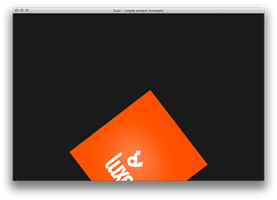
<span style="display:block;width:100%;text-align:center"> guide outcome </span>

### What are Entities, and what are Components?

You have probably heard about about component/entity systems at some point if you have made games, and with good reason as they are quite useful for the way games are often structured. This was mentioned in the [third guide](#three) with regards to sprite animation.

The terms are quite straight forward -   

- An Entity is a place to attach components to
- A Component adds some behaviour to an Entity, the one that it is attached to

**A quick concrete example**

- A Sprite on screen is an Entity, an "EnemyTower" sprite   
- A "ShootEveryThreeSeconds" is a component   
- A "TakeDamageUntilZeroAndThenDie" is a component   

This means that generally an entity doesn't do anything on it's own, it's a blank slate. By attaching components to it, it can become more specific at any time. This gives you the flexibility to compose dynamic items at runtime, and an entity is only defined by the components it has, not the code that is inside of it's class. If a tower wanted to fly for some reason, it can.

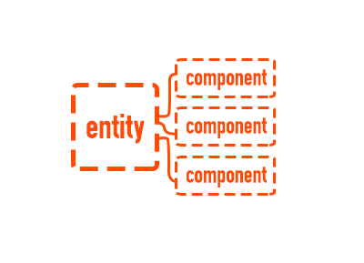

> It's worth knowing that there are a few approaches to "entity component systems" as a concept. In current luxe the component is a class that contains code and is attached to an entity which is a container for components. 

### Anatomy of a Component class

Component classes have some default functions that are called for you, much like the game class.
Have a look at the comments in the code below to see them.

```haxe
import luxe.Component;

class MyComponent extends Component {

    override function init() {
        //called when initialising the component
    }

    override function update(dt:Float) {
        //called every frame for you
    }

    override function onreset() {
        //called when the scene starts or restarts
    }

}
```

### Component spatial transforms

Components are directly tied to the entity they are attached to.   
When you change the transform from a component class - it is changing the entity itself.   

`pos.x = 100` changes the **_entity_** position.   
It is the same as saying `entity.pos.x = 100`.  
 
All of the spatial values, `pos` , `rotation` and `scale`, affect the entity transform directly. Keep this in mind!

#### Creating and accessing entities

### Creating entities 

Entities are created using the same common pattern of `new luxe.Entity(options)`. You can import `luxe.Entity` too. This entity will automatically be added to the default scene unless you ask it not to be. See the [EntityOptions](./api/luxe/options/EntityOptions.html) for all the flags.

```haxe
var entity = new Entity({ name:'entity_name' });
```

The `luxe.Sprite` and `luxe.Camera` class in luxe extend from the Entity class so that you can add components to them. 

### Accessing entities from other entities and components

By default, entities are stored in scenes by name so you can fetch them later. This means that when creating your sprite, or entity, you will want to pass the name as well. You fetch the sprite from the scene by accessing the entities property from the scene.

```haxe
public function init() {

    var sprite = new Sprite({
        name : 'spritename'
    });     

}

...

    //at a later time
var sprite: Sprite = cast Luxe.scene.entities.get('spritename');
```

#### Creating and accessing components

All components should typically extend from the `luxe.Component` class in order to behave as expected.

### Adding components to entities

Components are added to entities using the `add` function _on the entity_, and the `add` function returns the instance for convenience. This was also demonstrated in the [third beginner's guide](#three).

Remember to name things, since the name of the component is needed later for fetching a reference if you don't have one. Since the same entity can have multiple components of the same type, the name is of the unique instance. i.e If you had two health components on the same entity each one would need to be named to identify them later.

When you create a custom component, the constructor is in your hands, but remember to call _super_ with at least the name of the instance. You can see this in the example later. 

Also important to mind the timing of the system events. The constructor will be called when `new` is invoked, while `init` and other events will probably happen later. This makes the constructor relatively early and can cause confusion when things you expected to exist do not exist yet.

```haxe
var component : Component;
var entity : Entity;

override function ready() {

        // create an entity in the default scene
    entity = new Entity({ name:'some_entity' });

        // add/attach a component to the entity.
    component = entity.add(new Component({ name:'some_component' });

}
```

### Accessing the entity the component is attached to

When you are inside of a component and want to access the entity that the component is connected to, there is a variable called `entity` that is declared in the `Component` class as `entity : Entity`. 

When the entity is attached to a sub class of Entity (like a Sprite, which `extends Entity`), you can store a typed reference by using the `cast` keyword. The `onadded` function is a good place for that. Now you can use the sprite features without casting each time. Like below :

```haxe
var sprite : Sprite;

override function onadded() {

    sprite = cast entity;
    sprite.flipx = false; //`Sprite` specific

}
```

### Accessing other components attached to the entity

When you want to access other components attached to the entity, you can use the `get` function. The `get` function is available from inside the component class, or from the `entity.get` endpoint.   

The parameter passed into the get function is the _name of the component instance_ (which is passed into the constructor of the Component when calling the new function, or from `super` in subclasses).

```haxe
var move : Movement;

override function init() {

    move = cast get('move');

        move.speed *= 2;

    var health : Health = get('health');

        health.amount += 10;

}
```

#### A practical sample

To further demonstrate the component entity stuff, we will do the following : 

- Create a sprite (which is an entity)
- Attach a custom component that will rotate the sprite
- Attach a custom component that will make the sprite bounce

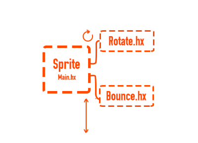

You can mix and match components in this way to create a variety of behaviours with little effort, and to change the behaviour on the fly.

### Rotate.hx

```haxe
import luxe.Vector;
import luxe.Component;
import luxe.Sprite;

//This component will rotate the entity 
//that it is attached to a small amount each frame.
//It is assumed that the entity is a Sprite! 

class Rotate extends Component {

    public var rotate_speed : Float = 10;
    public var max_rotate_speed : Float = 60;

    var sprite : Sprite;

    override function init() {
        sprite = cast entity;
    }

    override function update( dt:Float ) {

            //changes to the transform inside 
            //of components affect the entity directly!
        sprite.rotation_z += rotate_speed * dt;

    } //update

} //Rotate

```

### Bounce.hx

```haxe
import luxe.Component;

class Bounce extends Component {

    var dir : Int = 1;
    var speed : Int = 200;

    override function update( dt:Float ) {

        pos.y += speed * dir * dt;
            //hit the bottom? go back up
        if(pos.y > Luxe.screen.h) {
            dir = -1;
        }
            //hit the middle? go down
        if(pos.y < Luxe.screen.h/2) {
            dir = 1;
        }

    } //update

} //Bounce

```

The rest of the code can be found in the link at the start of the guide.

<a name="utils"></a> &nbsp;  
[back to top](#start)   

---

## Utilities and helpers

### Geometry utils

Often when dealing with geometry or geometrical constructions (like procedurally generating spaces) it's helpful to have functions or classes to make building complex things easier.

#### These functions are accessible through `Luxe.utils.geometry`

The geometrical utils object contains a handful of useful functions for exactly that, some examples:

- Determine line segments that make a smooth circle with a radius of _r_
- Generate a random point within a 1 radius circle area
- Find if a point is inside of this polygon (list of positions, or Geometry)
- Find a point of line intersect with an invisible plane

These functions are easily used by `Luxe.utils.geometry` from anywhere.

As the API changes and more additions are added,    
you will find the full list of utilities in the   
[GeometryUtils API docs](./api/luxe/utils/GeometryUtils.html)

### General utilities

These are functions that aren't specific to any discipline so there are many different kinds.   
Some of the examples include :

#### These functions are accessible through `Luxe.utils`

- generate a uniqueid or UUID
- get a haxe stacktrace as a string
- find assets in a sequence

### Math utilities

Haxe already has many maths utilities built in, in the [Math](http://api.haxe.org/Math.html) class.

On top of that, there are many game or rendering specific maths functions that are convenient to have,

These are all currently **static functions**, rather than an instance. i.e `Maths.radians( 90 )`

#### These functions are accessible through `luxe.utils.Maths`

- is a value within a range (useful for floating point "equality")
- wrap an angle smoothly around a fixed range (like 0~60 or 0~360)
- the nearest power of two value of a number
- smoothstep interpolations
- degrees/radians conversions
- random number helpers


You will find the full list of utilities in the   
[Maths API docs](./api/luxe/utils/Maths.html)
